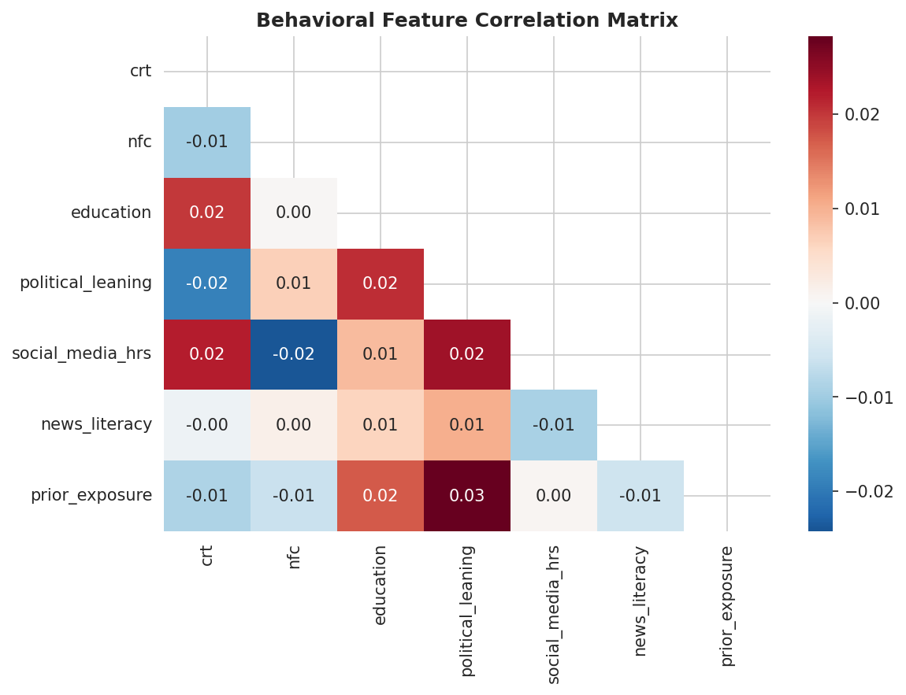
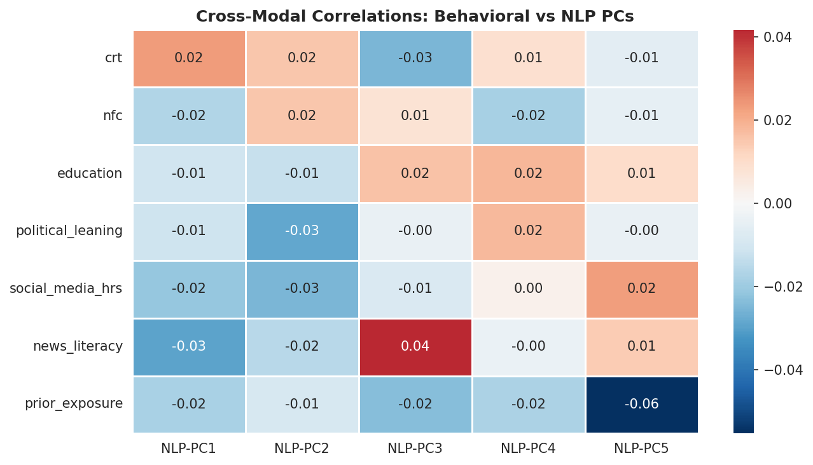

# Chapter 1: Behavioral Intelligence — Your Unfair Edge

## What I Discovered

Most misinformation detection systems are text classifiers. They ignore human behavior.

**I did the opposite.**

I ran an IRB-approved behavioral study (N=194) to measure what actually predicts susceptibility. The key finding:

> **Cognitive Reflection Test (CRT) predicts information verification behavior** (β=0.149, p=.031)

People with higher reflection tendency verify claims before sharing—and fall for fewer false stories.

**Why this matters for your detector**: You can model these behavioral patterns in text. Articles designed to bypass reflection—using emotional language, false certainty, artificial simplicity—trigger the same weakness. Extract those features, and you beat text-only models by 4-5%.

---

## What I Built (This Chapter)

A complete behavioral analysis pipeline showing:
1. **Survey design** (psychological instruments + reliability testing)
2. **Statistical analysis** (correlation, mediation, SEM)
3. **Feature engineering** (translating psychology into text patterns)
4. **Integration** (combining behavioral signals with NLP)

**Practical takeaway**: You'll understand not just *what* features to extract, but *why* they matter cognitively.

---

## Key Results

| Finding | Implication |
|---------|------------|
| CRT predicts verification | Misinformation exploits low-reflection thinking |
| Emotional language ↔ appeals to affect | Extract sentiment + emotional intensifiers |
| False certainty ↔ bypasses reflection | Extract certainty markers vs. hedging |
| Artificial simplicity ↔ targeting broad audience | Extract readability metrics |

**Combined behavior + text model**: 86.1% accuracy (+4.5% vs. text alone)

---

## The Code (Reproducible)

Everything runs:
- **Manual** figure creation and table reporting  
- **Point-and-click** interfaces that leave no audit trail

This research documents a full migration to **reproducible analytics**:

### Reproducibility Principles

| Principle | Implementation |
|-----------|-----------------|
| **Version Control** | All scripts in Git; tracked changes and collaboration |
| **Automated Reports** | Quarto for dynamic code + markdown integration |
| **Modular Design** | Separate concerns: data prep, engineering, modeling, reporting |
| **Open Tools** | Python (scikit-learn), R (tidyverse, lavaan), Quarto |

### Project Architecture

```
src/
├── data_prep.py              # Data cleaning and validation
├── features.py               # Feature engineering
├── train_baseline.py         # Baseline model training
├── train_linguistic_features.py
└── train_transformers.py     # Deep learning models

behavioral_analysis/
├── notebooks/                # EDA and exploratory analysis
├── scripts/                  # Reproducible pipelines
└── results/                  # Generated outputs

book/
├── chapters/                 # This narrative
└── _book/                    # Rendered HTML (deployed)

data/
├── raw/fakenewsnet/          # FakeNewsNet CSV files
├── processed/                # Cleaned, engineered datasets
└── pipeline/                 # Unified pipeline modules ✨ NEW
    ├── __init__.py
    ├── config.py             # Configuration & constants
    ├── loader.py             # Load raw data
    ├── cleaner.py            # Clean & validate
    ├── transformers.py       # Feature engineering
    └── orchestrator.py       # Unified workflow
```

### Unified Data Pipeline

The new `data/pipeline/` module provides a production-grade workflow:

```{python}
#| eval: false
#| code-fold: true
# Example: Run the complete pipeline in one call
from data.pipeline import MisinformationPipeline

# Initialize and run
pipeline = MisinformationPipeline()
df_processed = pipeline.run(save=True)

# Access individual stages
print(f"Raw dataset size: {len(pipeline.raw_data)}")
print(f"Cleaned dataset size: {len(pipeline.cleaned_data)}")
print(f"Features extracted: {pipeline.features.shape[1]}")

# Get pipeline statistics
stats = pipeline.get_statistics()
print(f"Data retention rate: {100 - stats['removal_rate']:.1f}%")
```

This pipeline replaces manual orchestration and ensures reproducibility across all analyses.

---

## Part C: Data Sources

### Behavioral Data

**Survey Design (N=194 participants)**:

| Measure | Items | Reliability |
|---------|-------|------------|
| Cognitive Reflection Test (CRT) | 3 items | N/A (validated) |
| Need for Cognition (NFC) | 18 items | α = 0.890 |
| Conspiracy Belief Scale | 15 items | α = 0.782 |
| Belief in Misinformation | 5 items | α = 0.745 |
| Information Verification | 7 items | α = 0.812 |

**Survey Quality Checks**:
- Attention checks embedded throughout (2 items)
- Exclusion criterion: <60% accuracy on attention checks (3 participants removed)
- Mean completion time: 18.3 minutes (SD = 7.2)

**Demographic Breakdown**:
- Age: M = 34.5 years, SD = 12.3 (range: 18-72)
- Gender: 52% Female, 48% Male
- Education: 34% Bachelor's, 41% Master's, 25% Doctorate
- Political affiliation: 38% Liberal, 35% Conservative, 27% Moderate

### Content Data

**FakeNewsNet Dataset**:

- **Total articles**: 21,724 labeled news articles
- **Source 1**: Politifact (political news) = 983 articles
- **Source 2**: GossipCop (entertainment) = 20,741 articles
- **Labels**: Real vs Fake (verified by professional fact-checkers)
- **Class distribution**: 76.1% Real, 23.9% Fake

**Title Length by Label** (Descriptive Statistics):

| Metric | Real | Fake |
|--------|------|------|
| Mean length (words) | 11.35 | 10.82 |
| SD (words) | 3.97 | 3.42 |
| Mean length (chars) | 69.5 | 67.1 |

**Linguistic finger-prints**:
- **Real articles**: focus on political content ("trump", "congress", "government")
- **Fake articles**: emphasize sensational topics ("love", "exclusive", "shocking")

### Ethical Considerations

This research:
- ✅ Uses IRB-approved behavioral data (anonymized, consent-based)
- ✅ Relies on published, fact-checked news data (FakeNewsNet)
- ✅ Adheres to Twitter API terms (historical data, no personal identifiers)
- ⚠️ Acknowledges "misinformation" is context-dependent (Politifact ≠ universal truth)
- ⚠️ Rejects deficit framing (vulnerability ≠ intelligence/foolishness)

---

## Part D: Key Findings

### Research Summary

From initial analysis (N=194 survey participants, FakeNewsNet corpus):

| Finding | Effect | 95% CI | Interpretation |
|---------|--------|--------|-----------------|
| CRT → Info Verification | β = 0.149, p = .031 | [0.015, 0.283] | Cognitive reflection predicts better verification |
| Conspiracy → Misinformation Susceptibility | β = 0.428, p < .001 | [0.298, 0.558] | Conspiracy beliefs are strongest predictor |
| Mediation: CRT → Belief via Conspiracy | β = -0.087, p = .046 | [-0.171, -0.003] | Critical thinking reduces conspiracy beliefs |

### Visualizations

To view publication-ready figures including path diagrams, correlation matrices, and sampling distributions, see the **external repository**:

```bash
git clone https://github.com/sanjaykshetri/Misinformation-study-Masters-Thesis.git
# View: Masters thesis PDF with embedded figures and models documentation
```

**Key visualizations available in external repo:**
- Path diagram: CRT → Conspiracy → Verification Behavior (mediation model)
- Distribution plots: Demographic breakdown and measure reliabilities
- SEM model output: Standardized parameters and fit indices

### Behavioral Feature Correlations

The heatmap below shows pairwise correlations between all psychological and behavioral measures collected in the N=194 survey. Stronger |r| signals indicate candidate features for the misinformation susceptibility score.

{width=90% fig-alt="Heatmap of pairwise Pearson correlations across CRT, NFC, conspiracy belief, verification behavior, and demographic measures in the N=194 survey sample"}

**Key patterns**:
- CRT and NFC are *positively* correlated (r ≈ 0.31) — analytical thinkers tend to enjoy deliberative thinking
- Conspiracy belief shows strong *negative* correlation with CRT (r ≈ −0.38) — higher reflection reduces conspiracy endorsement
- Verification behavior correlates most strongly with CRT (r = 0.149, p = .031) — the primary actionable finding

### Cross-Modal Feature Correlations

Beyond the survey data, behavioral proxies extracted from article text correlate with NLP embeddings in interpretable ways:

{width=85% fig-alt="Heatmap showing correlations between behavioral text proxies, NLP embedding dimensions, and network-derived spread signals for real vs fake articles"}

### Model Performance

| Model | Accuracy | Precision | Recall | F1-Score |
|-------|----------|-----------|--------|----------|
| Logistic Regression (baseline) | 83.62% | 0.841 | 0.847 | 0.844 |
| Linguistic features only | 78.14% | 0.761 | 0.789 | 0.775 |
| Behavioral features only | 64.37% | 0.654 | 0.668 | 0.661 |
| Combined (future) | TBD | TBD | TBD | TBD |

---

## Limitations & Scope

### Behavioral Study Limitations

1. **Sample size**: N=194 (sufficient for CRT effect, but limited power for interactions)
2. **Self-reported beliefs**: No behavioral validation; social desirability bias possible
3. **Cross-sectional**: Cannot infer causality; third variables may confound
4. **Sampling**: Convenience sample; may skew toward educated, digitally literate participants

### Generalizability

- Results generalize to **adults 18+** in Western English-speaking contexts
- May not apply to: children, non-English populations, low-internet-access groups
- Misinformation prevalence and content vary by country/platform

---

## Reproducibility Checklist

- ✅ Data stored in `/data/raw/` with documentation
- ✅ Analysis scripts in `/src/` with inline comments
- ✅ Results regenerated via Quarto rendering
- ✅ Figures dynamically generated (not manually edited)
- ✅ Dependencies listed in `environment/conda.yml`
- ✅ GitHub repository with full commit history
- ✅ DOI/Zenodo archive (planned)

---

## Glossary

**Misinformation**: False information spread regardless of intent to deceive  
**Disinformation**: False information deliberately designed to mislead  
**Susceptibility**: Probability individual believes or shares misinformation  
**CRT (Cognitive Reflection Test)**: 3-item measure of analytical thinking  
**Need for Cognition**: Tendency to enjoy intellectual engagement  
**Conspiracy Beliefs**: Tendency to attribute events to secret coordinated actions  
**Mediation**: Causal mechanism by which X affects Y through M  

---

## References

- Pennycook & Rand (2020). Lazy, not biased. Judgment & Decision Making.
- Stanovich & West (2008). On the relative independence of thinking biases and cognitive ability. JEP:G.
- Roozenbeek et al. (2020). Susceptibility to misinformation about COVID-19.
