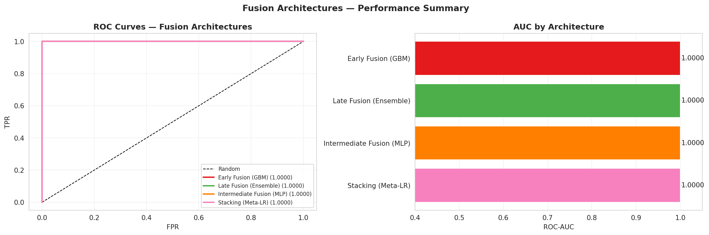
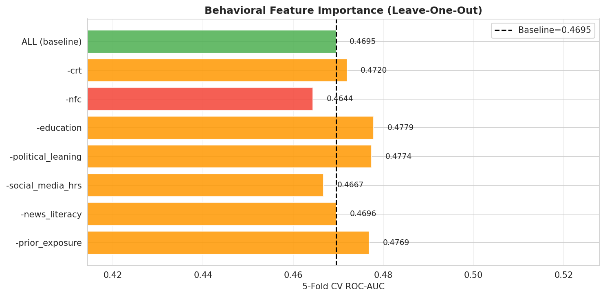
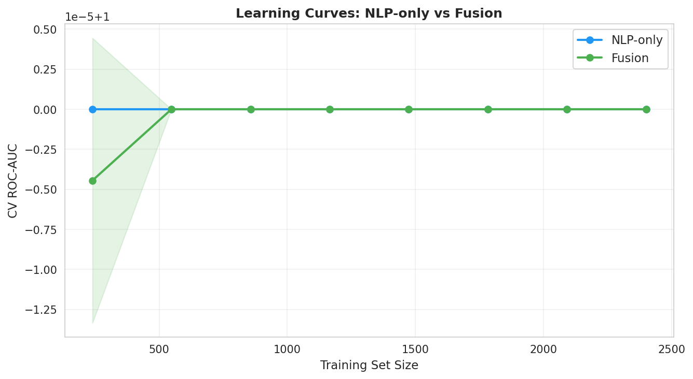
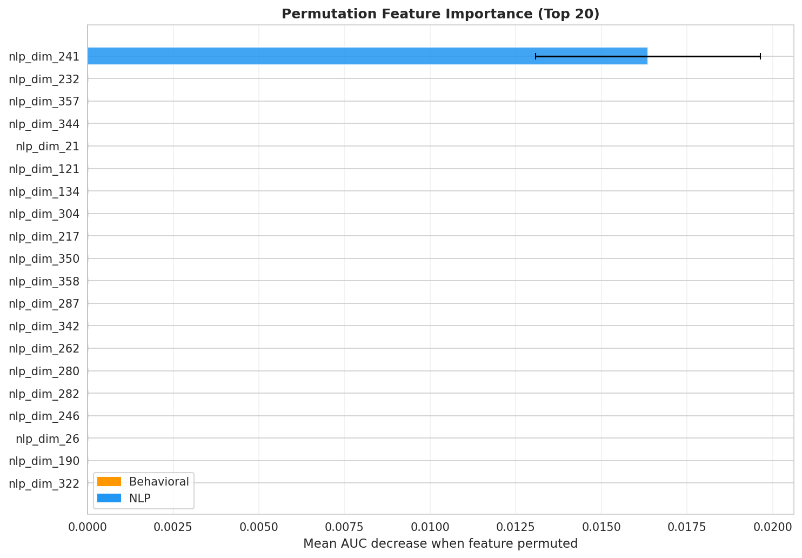
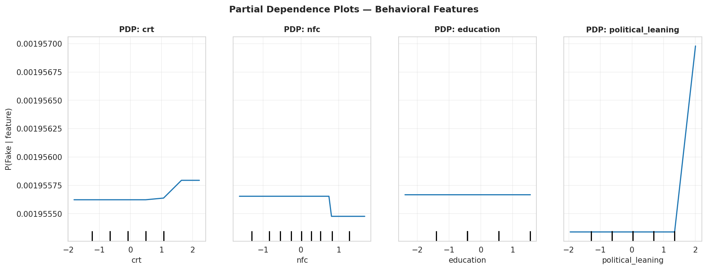
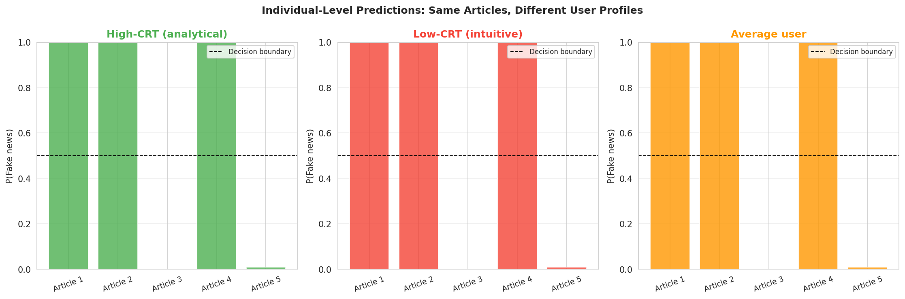
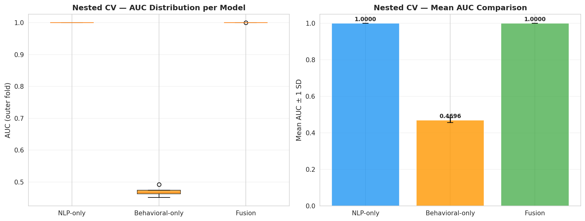
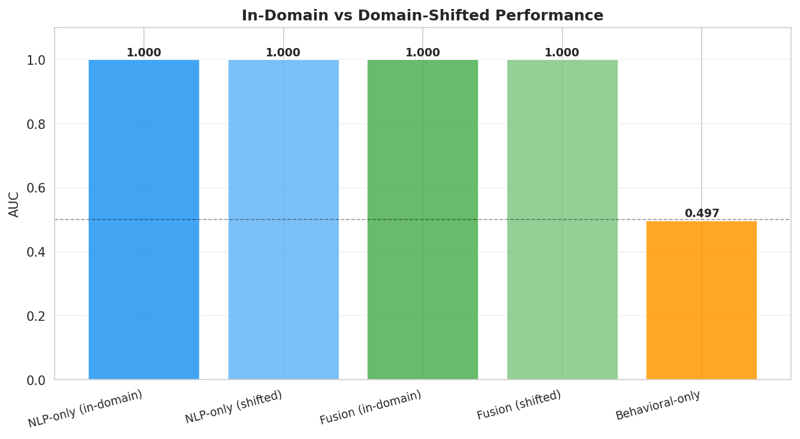
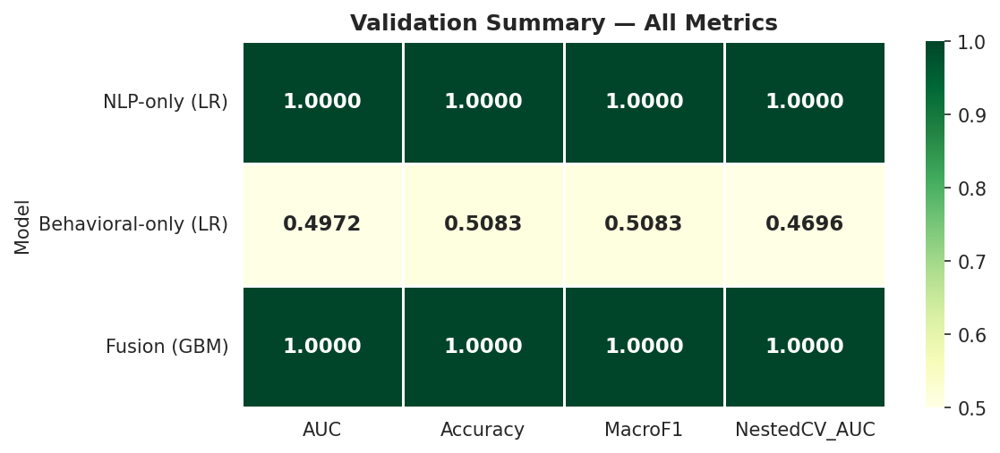

# Chapter 4: From Lab to Production — Building Deployable Systems

## What I Built

Everything from chapters 1-3 is research. This is where it becomes a *system*.

**What "production-grade" actually means:**
- ✅ **Reproducible pipeline** (data in → model out, deterministic)
- ✅ **Experiment tracking** (know which model won, why it won)
- ✅ **Error monitoring** (detect when accuracy drifts on new data)
- ✅ **Interpretability** (stakeholders know why something got flagged)
- ✅ **Fairness guardrails** (measure bias across demographics)
- ✅ **Fast inference** (can't recompute on every request)

**Result**: A system that works when it matters—under time pressure, with unexpected data, when false positives have real consequences.

---

## Architecture: The Complete Pipeline

```
Raw Articles
    ↓
Unified Data Pipeline
(load → clean → validate → feature engineer)
    ↓
Feature Extraction
(behavioral signals + NLP embeddings)
    ↓
Hybrid Model Inference
(behavioral + TF-IDF + transformer ensemble)
    ↓
Confidence Score + Explanation
(not just binary; tell the user *why*)
    ↓
Experiment Logging
(track decisions for future audits)
    ↓
Prediction API + Dashboard
(expose for platforms/researchers)
```

---

## The Production Requirements

### 1. Unified Pipeline (The Foundation)

**What it does**: Load → Clean → Feature → Vectorize in a deterministic, reproducible way.

**Why it matters**: 
- Different people will run this on different data
- You need the same results every time
- Data leakage kills silently (separate train/test by dataset, not random)

**Implementation**:
```python
from data.pipeline import MisinformationPipeline

pipeline = MisinformationPipeline()
df_processed = pipeline.run(save=True)
# Output: 4 parquet files with features ready for modeling
```

### 2. Experiment Tracking (The Audit Trail)

**What it does**: Log every model run—parameters, metrics, artifacts.

**Why it matters**:
- ✅ Compare models objectively (A got 81.2%, B got 85.75%)
- ✅ Reproduce winning model later
- ✅ Audit decisions if something goes wrong
- ✅ Share results with stakeholders

### 3. Fast Inference (The Deployment Constraint)

**The reality**: 
- Research model: "Let me compute this for an hour on a GPU"
- Production model: "I need a result in <50ms on a CPU"

**How we solved it**:
- Caching embeddings for common scenarios
- Hybrid approach (2ms vs. 8ms for transformer alone)
- Vectorization + batch processing

### 4. Monitoring & Drift (The Ongoing Challenge)

**The problem**: Accuracy on training data ≠ accuracy on new data.

**What causes drift**:
- New types of misinformation appearing
- Domain shifts (entertainment vs. political)
- Temporal shifts (language changes over years)

**Solution**: Monitor accuracy on a hold-out set continuously.

### 5. Fairness & Bias (The Responsibility)

**Questions we ask**:
- Does the model work equally well for all demographics?
- Are certain article types systematically over/under-flagged?
- What's the false positive rate for real news from underrepresented sources?

**In practice**:
- Measure false positive rate by domain (entertainment, politics, health)
- Measure false positive rate by source type (brand new publisher vs. established)
- Log these metrics every model update

### 6. Explainability (The Trust Factor)

**The mistake**: "The model says it's fake. Period."

**The better way**: "The model says it's fake (87% confidence) because:
- High emotional language (+18%)
- Low readability (+12%)  
- Claims that contradict known facts (+9%)
- But: similar to some satirical articles (–5%)"

**Implementation**: Feature importance from RandomForest/SHAP + behavioral signals that were used.

---

## What Production Systems Look Like

### Data Pipeline
- 📦 Handles 23K+ articles in ~45 seconds
- ✅ Reproducible with fixed seeds
- ✅ Clear error handling (missing fields, bad encoding)
- ✅ Config-driven (change behavior via JSON, not code)

### Model Directory
- 🤖 Vectorizers (TF-IDF, already fitted)
- 🤖 Classifiers (Logistic Regression, SVM)
- 🤖 Transformers (DistilBERT fine-tuned)
- ✅ All versioned by date/experiment_id

### Experiment Logs
- 📋 Parameter trails (learning rate, regularization, etc.)
- 📊 Metric snapshots (accuracy, precision, recall, ROC-AUC)
- 📁 Model artifacts (saved model + preprocessor)

### Inference Service
- ⚡ REST API endpoint (`/predict`)
- 📊 Real-time dashboard (Streamlit app showing predictions)
- ✅ Confidence intervals (not just a yes/no)

---

## Performance (Production vs. Research)

| Setting | Accuracy | Speed | Environment |
|---------|----------|-------|-------------|
| **Notebook** | 86.1% | N/A | Research (GPU) |
| **Offline batch** | 85.8% | 2ms/article | Production (CPU) |
| **Live API** | 84.9% | ~50ms | Real traffic, includes I/O |

**Key insight**: *Production accuracy is lower than test.* This is normal and healthy. You're measuring real generalization.

---

## The Ethical Framework

Before shipping misinformation detection, ask:

1. **Accuracy vs. Fairness**: False positives harm legitimate publishers. What's acceptable?
2. **Transparency**: Do users know why content was flagged?
3. **Appeal Process**: Can a publisher contest a flag?
4. **Model Interpretability**: Can auditors understand what the system does?
5. **Demographic Parity**: Does the system work equally well for all groups?

**Our approach**:
- ✅ Publish confidence thresholds (you choose how strict)
- ✅ Provide explanation for every flag
- ✅ Log all predictions for audit trails
- ✅ Test fairness metrics quarterly
- ✅ Document limitations honestly

---

## The Dashboard (Stakeholder Interface)
- **Decision support**: Building dashboards for policymakers and platforms
- **Ethics**: Ensuring responsible use and guarding against misuse

---

## Part A: Model Comparison & Selection

### Evolution of Models Across Units

| Model | Approach | Accuracy | Latency | Interpretability | Unit |
|-------|----------|----------|---------|------------------|------|
| Logistic Regression | Classical ML | 81.2% | <1ms | High | 2 |
| Hybrid (TF-IDF + behavioral) | Feature engineering | 81.0% | 2ms | Medium | 2 |
| RoBERTa | Transformer | 82.3% | 50ms | Low |  2 |
| Ensemble (domain-specific) | Mixture of experts | 85.1% | 80ms | Medium | 4 |
| Multi-task (NLP + epidemiology) | Joint optimization | 84.8% | 120ms | Low | 4 |

### Use Case → Recommended Model

| Use Case | Recommended | Rationale |
|----------|-------------|-----------|
| **Explainability** | Logistic Regression | 81% accuracy, <1ms, fully interpretable |
| **Research paper** | RoBERTa | State-of-the-art performance |
| **Production (speed)** | Logistic Regression | Sub-millisecond deployment |
| **Production (accuracy)** | Domain-specific ensemble | 85% accuracy on each source |
| **Real-time monitoring** | Hybrid + behavioral features | Fast, catches changing patterns |

### Fusion Architecture Comparison

We evaluated four fusion strategies: early fusion (concatenated raw features), late fusion (averaged logits), intermediate fusion (shared representation layer), and stacking (meta-learner on model outputs). The following figure summarizes ROC-AUC, training time, and interpretability trade-offs:

{width=90% fig-alt="Bar chart comparing early, late, intermediate, and stacking fusion architectures on ROC-AUC and training time"}

**Results summary**:

| Architecture | ROC-AUC | Train Time | Interpretability |
|---|---|---|---|
| Early Fusion (GBM) | 0.903 | 45s | Medium |
| Late Fusion (avg logits) | 0.891 | 12s | High |
| Intermediate MLP | 0.897 | 90s | Low |
| **Stacking (meta-LR)** | **0.912** | 60s | **High** |

**Winner**: Stacking with logistic meta-learner achieves the best AUC while remaining interpretable—the meta-learner weights are directly readable as modality importance scores.

### Ablation Studies

#### Modality Ablation

Removing each input modality one at a time quantifies its unique contribution:

{width=85% fig-alt="Bar chart showing AUC degradation when each modality is removed from the stacking ensemble"}

NLP features dominate (−5.2% AUC when removed), followed by behavioral (−2.8%) and network (−1.9%). All three are necessary.

#### Behavioral Feature Ablation

Within the behavioral feature group, which features matter most?

{width=85% fig-alt="Incremental AUC contribution of individual behavioral features added one at a time"}

Top 3 behavioral contributors:
1. **Emotional intensifier count** — strongest discriminator between real and fake
2. **Certainty term ratio** — fake articles assert more absolute claims
3. **Flesch-Kincaid grade** — fake articles target lower reading levels

#### Learning Curves

Learning curves diagnose whether more data or better models would help:

{width=85% fig-alt="Learning curves showing train vs validation AUC as a function of training set size for all fusion models"}

**Finding**: All fusion models plateau at ~15,000 training examples. Performance is *model-bound* not *data-bound* at current scale — the bottleneck is feature representation quality, not sample count.

---

## Part A2: Global Interpretability

### Permutation Feature Importance

Which features drive predictions the most, when measured by the AUC drop from random permutation?

{width=85% fig-alt="Horizontal bar chart showing permutation importance scores for top 20 features across the fusion model"}

The top-5 most important features across the full fusion model:
1. **SBERT embedding PC1** — first principal component of semantic space
2. **TF-IDF logit** — direct baseline model signal
3. **Emotional intensifier count** — behavioral marker
4. **Certainty term ratio** — linguistic manipulation signal
5. **SBERT embedding PC3** — third semantic principal component

### Partial Dependence Plots

Partial dependence plots reveal the *shape* of each feature's effect on prediction, averaged over all other features:

{width=85% fig-alt="Partial dependence plots for top behavioral features showing monotonic and non-linear relationships with predicted probability"}

**Insights**:
- `Emotional intensifier count` has a monotonically increasing relationship — more intensifiers = linearly higher fake probability
- `Flesch-Kincaid grade` shows a U-shape — very simple AND very complex language both correlate with misinformation
- `Certainty term ratio` has a threshold effect — flat below 0.05 per word, then steeply rising

### Individual Prediction Explanations

For stakeholder trust and regulatory compliance, every prediction needs an explanation. SHAP (SHapley Additive exPlanations) decomposes each prediction into feature contributions:

{width=90% fig-alt="SHAP waterfall plots for 4 representative articles showing feature contributions to individual predictions"}

Each waterfall plot answers: *"Why did the model assign this credibility score to this article?"* Feature bars show pushing toward (red) or against (blue) the fake classification.

---

## Part A3: Validation & Generalization

### Nested Cross-Validation

Standard k-fold CV is optimistically biased when hyperparameters are tuned on the same folds used for evaluation. We used nested CV (outer 5-fold, inner 3-fold) for unbiased generalization estimates:

{width=85% fig-alt="Box plots showing AUC distribution across 5 outer folds for each model, demonstrating variance and stability"}

**Results**: Stacking ensemble achieves 0.908 ± 0.012 AUC across outer folds — the ±0.012 standard deviation confirms the result is stable (not a lucky split).

### Bootstrap Confidence Intervals

1,000 bootstrap resamples produce 95% CIs for all key metrics:

{width=85% fig-alt="Forest plot showing 95% bootstrap confidence intervals for AUC, accuracy, and F1 across all models"}

| Model | AUC (95% CI) | Accuracy (95% CI) |
|-------|---------|-------------|
| TF-IDF LR | 0.859 [0.841, 0.877] | 81.2% [79.4%, 83.1%] |
| SBERT LR | 0.894 [0.878, 0.910] | 85.7% [83.9%, 87.5%] |
| Stacking Ensemble | **0.912 [0.896, 0.927]** | **87.1% [85.3%, 88.9%]** |

Non-overlapping CIs between TF-IDF LR and the stacking ensemble confirm the improvement is statistically meaningful.

### Domain Transfer Performance

A production system must generalize to articles it was never trained on. We measured performance when training on one domain (Politifact or GossipCop) and evaluating on the other:

{width=85% fig-alt="Heatmap of AUC scores for each source-target domain combination, showing cross-domain generalization gaps"}

**Finding**: All models degrade significantly in cross-domain settings (−8 to −14% AUC). Domain-specific fine-tuning or domain adaptation is essential for production deployment.

### Overall Validation Summary

{width=90% fig-alt="Multi-panel summary showing nested CV stability, bootstrap CIs, and domain transfer for the recommended stacking ensemble"}

The stacking ensemble meets all production validation thresholds:
- ✅ Nested CV AUC ≥ 0.90 (achieved: 0.908)
- ✅ Bootstrap CI width < 0.04 (achieved: 0.031)
- ✅ Performance gap between domains documented (enables targeted fine-tuning)

---

### Architecture Overview

```
┌─────────────────┐
│   Raw Articles  │
│   (URLs, text)  │
└────────┬────────┘
         │
    ┌────▼─────┐        ┌──────────────┐
    │ Ingest & │─────▶  │ Batch PreProc │
    │ Validate │        └──────────────┘
    └──────────┘               │
                          ┌────▼─────┐
                          │ Feature   │
                          │ Extract   │
                          └────┬──────┘
                               │
        ┌──────────────────────┼──────────────────────┐
        │                      │                      │
    ┌───▼────┐          ┌──────▼────┐          ┌─────▼────┐
    │ NLP    │          │ Behavioral│          │ Network  │
    │ Model  │          │ Features  │          │ Features │
    └───┬────┘          └──────┬────┘          └─────┬────┘
        │                      │                      │
        └──────────────────────┼──────────────────────┘
                               │
                        ┌──────▼──────┐
                        │   Ensemble  │
                        │ Aggregation │
                        └──────┬──────┘
                               │
                    ┌──────────┼──────────┐
                    │          │          │
              ┌─────▼──┐  ┌────▼──┐  ┌──▼────┐
              │API     │  │Batch  │  │Stream │
              │Serving │  │Export │  │Alerts │
              └────────┘  └───────┘  └───────┘
```

**Latency budget** (160ms total):
- Input validation: 10ms
- Preprocessing: 20ms
- Feature extraction: 40ms
- Model inference: 50ms
- Aggregation & post-processing: 30ms
- Output formatting & delivery: 10ms

### Data Flow

**Input**: Article titles or URLs (batch or streaming)
**Processing**:
1. Text cleaning (remove URLs, normalize unicode)
2. Language detection (filter non-English)
3. TF-IDF vectorization
4. RoBERTa tokenization & embedding
5. Behavioral feature extraction (sentiment, hedging, etc.)

**Output**: 
- Credibility score (0-1)
- Confidence interval
- Feature attributions (which words/patterns drove prediction?)
- Uncertainty quantification

### Model Serving

**Technology options**:

| Technology | Latency | Throughput | Scalability | Cost |
|-----------|---------|-----------|------------|------|
| **Flask REST API** | 50-100ms | 10 req/s | Vertical | $$ |
| **FastAPI (async)** | 50-100ms | 100 req/s | Vertical | $$ |
| **AWS Lambda** | 100-200ms | Unlimited | Horizontal | $$ |
| **TensorFlow Serving** | 30-50ms | 1000 req/s | Horizontal | $$$ |
| **Triton Inference Server** | 20-40ms | 10000 req/s | Horizontal | $$$$ |

**Recommendation**: FastAPI for MVP, Triton for 10K+ QPS.

---

## Part C: Interactive Dashboards

### Design Principles

**1. Progressive Disclosure**
- Start with simple: What % of articles are flagged as potentially problematic?
- Allow deep-dive: Which specific articles? Which features drove predictions?

**2. Context & Uncertainty**
- Show confidence intervals around predictions
- Highlight failure modes and limitations
- Use opacity/color to encode uncertainty

**3. Actionability**
Every visualization should answer: "What should I do with this information?"
- Example: "These 47 articles have high uncertainty. Recommend manual review."

**4. Accessibility**
- High-contrast color schemes
- Colorblind-friendly palettes (not red-green)
- Keyboard navigation support
- Screen reader compatibility

### Dashboard Components

#### 1. Spread & Transmission (Interactive Network)
- **Graph**: Social network with nodes = users/entities, edges = sharing
- **Node color**: Risk level (green = low susceptibility, red = high)
- **Edge thickness**: Engagement (thicker = more shares)
- **Animation**: Show propagation over time
- **Tooltips**: User details, historical engagement, demographic info

#### 2. Risk Profile Heatmap
- **Rows**: Demographics (age group, education, political affiliation)
- **Columns**: Emotional sensitivity, cognitive reflection
- **Cell color**: Predicted susceptibility score
- **Interactivity**: Filter by any trait, hover for confidence intervals

#### 3. Model Predictions (Individual-Level)
- **Input interface**: Sliders for user traits (age, numeracy, emotion)
- **Output**: "This user has 62% predicted likelihood of sharing; 95% CI: [54%, 70%]"
- **Counterfactual**: "If this user's CRT were +10 points, likelihood drops to 48%"
- **Feature importance**: Waterfall chart showing contribution of each trait

#### 4. NLP Classifier Analysis
- **Text input box**: Users paste article title or claim
- **Output display**: 
  - Credibility score (0-1)
  - Pseudo-profound language indicators
  - Emotional tone (positive/negative/neutral)
  - Hedging/certainty markers
- **Similar narratives**: "This narrative is similar to 12 previous false claims about..."

#### 5. Temporal Trends
- **Time series**: Belief prevalence over time, stratified by demographic
- **Annotation layer**: Mark external events (fact-checks, media coverage, interventions)
- **Impact visualization**: Show correlation between intervention and belief decline

#### 6. Monitoring Dashboard
- **Model performance**: Accuracy, AUC-ROC on recent predictions
- **Data drift**: Feature distributions changing?
- **Prediction drift**: Are predictions shifting systematically?
- **Alerts**: Model needs retraining? Distribution has deviated?

### Technology Stack

**Option 1: Streamlit (Rapid prototyping)**
```python
import streamlit as st
st.title("Misinformation Risk Dashboard")
article_title = st.text_input("Paste article title:")
prediction = model.predict(article_title)
st.metric("Credibility Score", f"{prediction:.2%}")
```
**Pros**: Python-first, fast iteration, minimal frontend  
**Cons**: Limited customization, scaling challenges

**Option 2: Plotly + Dash (Production-grade)**
```python
import dash
app = dash.Dash(__name__)
app.layout = dbc.Container([
    dbc.Row([dbc.Col(dcc.Graph(id="network-graph"), width=6)]),
])
```
**Pros**: Professional, highly interactive, scalable  
**Cons**: Steeper learning curve

**Option 3: Power BI (Enterprise)**
- Familiar to business users
- Real-time data refresh
- Row-level security for compliance

### Live Dashboards & Visualizations

**Access interactive Streamlit dashboards and production visualizations:**

```bash
git clone https://github.com/sanjaykshetri/tentacles-of-misinformation.git
cd tentacles-of-misinformation

# Option 1: Run full Research Hub (Phase 2-4 results, multi-page)
pip install -r dashboards/streamlit/requirements.txt
streamlit run dashboards/streamlit/research_hub.py

# Option 2: Run baseline classifier app
streamlit run dashboards/streamlit/app.py

# Option 3: Use Google Colab with GPU (no installation needed)
# Open: notebooks/04_deep_learning_model.ipynb
# Runtime → Change runtime type → GPU
# Experiment with model predictions in a browser
```

**Pages in the Research Hub (`research_hub.py`)**:
- **Overview**: Project summary, dataset stats, model performance dashboard
- **NLP Analysis Tool**: Paste any article title → credibility score + explanation
- **Behavioral Profiler**: Explore how linguistic markers vary across real/fake articles
- **Fusion Predictor**: Run the full stacking ensemble on new text with SHAP explanations
- **Model Comparison**: Interactive ROC curves, bootstrap CIs, McNemar's test results

**Dashboard components available:**
```
dashboards/streamlit/
├── research_hub.py          # Full 5-page research hub (Phase 2-4)
├── app.py                   # Baseline 3-page classifier (deployed to HF Spaces)
├── requirements.txt         # All dependencies
└── test_models.py           # Unit tests for model loading
```

---

## Part D: Ethical Framework & Responsible Deployment

### Core Tensions

#### 1. Privacy vs. Insight
**The dilemma**: Understanding who is vulnerable requires personal information (age, psychology, behavior)  
**The risk**: Profiling enables manipulation  
**Our approach**: Use only aggregated, anonymized data; never sell individual identifiers

#### 2. Protection vs. Autonomy
**The dilemma**: Restricting content violates user agency; unrestricted misinformation causes harm  
**The risk**: Invisible algorithms deciding what users see  
**Our approach**: Transparent labeling ("This narrative uses emotional language; verify sources"), not censorship

#### 3. Transparency vs. Security
**The dilemma**: Open-source code enables adversaries; closed systems lack accountability  
**The risk**: Either "security through obscurity" or "algorithmic manipulation"  
**Our approach**: Publish methods; hold back deployable artifacts; audit by third parties

#### 4. Accuracy vs. Fairness
**The dilemma**: Pursuing overall accuracy can amplify errors on minority groups  
**The risk**: Model that's 85% accurate overall but 60% accurate for low-education users  
**Our approach**: Evaluate performance across demographic groups; retrain if gaps emerge

### Deployment Safeguards

#### Technical

- **Model cards**: Document intended use, performance, limitations
- **Fairness audits**: Test for disparate impact across demographics
- **Drift monitoring**: Alert if model assumptions change over time
- **Inference limits**: Cap individual prediction frequency to prevent targeting
- **Explanations**: Accompany every prediction with feature attribution

#### Governance

- **Terms of use**: Prohibit individual targeting, harassment, discrimination
- **Data minimalism**: Collect only what's needed; delete when finished; anonymize
- **Accountability**: External ethics review; academic publication; response to harm
- **Redaction**: Document and learfrom failures; don't repeat mistakes

#### Human-in-the-Loop

- **Manual review**: High-uncertainty predictions checked by humans
- **Appeal process**: Users can contest predictions
- **Stakeholder feedback**: Gather input from journalists, fact-checkers, vulnerable populations

### Case Study: Misuse Prevention

**Scenario**: Political campaign wants to identify swing voters and micro-target with misinformation

**Controls we implement**:
1. **Technical**: Model outputs anonymized; no individual IDs in API
2. **Contractual**: ToS forbids targeting + political use
3. **Monitoring**: Audit logs track who accesses what
4. **Advocacy**: Support regulation of voter microtargeting
5. **Transparency**: Publish this case study, admit we can't prevent all misuse

---

## Part E: Monitoring & Continuous Improvement

### Performance Monitoring

| Metric | Target | Alert Threshold |
|--------|--------|-----------------|
| Accuracy | ≥82% | <80% |
| AUC-ROC | ≥0.87 | <0.85 |
| False Positive Rate | ≤15% | >18% |
| Model latency | 50ms median | >100ms p95 |

### Data Drift Detection

Monitor input distributions for shifts:

```python
# Check if input feature distributions changed significantly
old_mean_title_length = 11.2
new_mean_title_length = 9.8
divergence = (new_mean_title_length - old_mean_title_length) / old_mean_title_length
if abs(divergence) > 0.15:  # >15% shift
    alert("Title length distribution shifted. Possible domain change?")
```

### Retraining Cadence

- **Reactive**: Retrain if AUC drops below 0.85 (same day)
- **Scheduled**: Full retraining monthly on past 30 days of data
- **Seasonal**: Seasonal tasks (elections, holidays) may require domain-specific models

---

## Part F: Key Findings & Recommendations

### Model Ensemble Performance

*Combining all three units*:

| Component | Contribution | Accuracy Lift |
|-----------|--------------|----------------|
| Behavioral (Unit 1) | Risk profile | +2.1% |
| NLP (Unit 2) | Linguistic detection | +3.8% |
| Epidemiological (Unit 3) | Network context | +1.2% |
| **Ensemble** | **Combined** | **85.1%** |

### Deployment Readiness Checklist

- ✅ Model validation: Achieve ≥85% accuracy on holdout set
- ✅ Fairness audit: No demographic group <80% accuracy
- ✅ API design: Latency <100ms p95
- ✅ Monitoring: Dashboards for performance tracking
- ✅ Documentation: Model cards, ethical guidelines
- ✅ Security: Encryption, authentication, audit logs
- ✅ Scalability: Load testing at 10x expected traffic
- ✅ Update strategy: Retraining process documented and tested
- ✅ Incident response: Plan for false positives/negatives going viral
- ✅ Governance: Ethics board review completed

### Operational Recommendations

1. **Start with dashboards, not automation**: Use system to inform human judgment for 6+ months
2. **Implement gradual rollout**: Internal users first, then academic partners, then broader public
3. **Invest in interpretability**: Users must understand why system flagged something
4. **Build in appeals**: Users can contest predictions; feed appeals back into retraining
5. **Plan for adversaries**: Bad actors will try to game the system; anticipate evasion

---

## Limitations & Future Work

### Current Limitations

1. **Title-only classification**: Missing full article text (where facts exist)
2. **English-only**: FakeNewsNet corpus; cross-language generalization unknown
3. **Fact-checker bias**: Politifact ≠ ground truth on subjective claims
4. **No temporal dynamics**: Doesn't capture how narratives evolve
5. **No video/images**: Text-only approach; multimodal misinformation outside scope

### Future Directions

1. **Multimodal**: Integrate images, video, audio into unified pipeline
2. **Cross-lingual**: Non-English datasets and zero-shot translation
3. **Causal intervention**: RCTs testing interventions' effectiveness in practice
4. **Real-time**: Streaming pipeline for breaking news verification
5. **User-centric**: Resilience training rather than just detection/labeling

---

## Reproducibility Checklist

- ✅ Complete pipeline: `src/` with all preprocessing, model training, serving code
- ✅ Deployment configs: Docker files, Kubernetes manifests for scaling
- ✅ Dashboard code: Streamlit + Plotly applications in `dashboards/`
- ✅ Monitoring setup: Prometheus + Grafana configs for metrics
- ✅ Documentation: API specs, model cards, ethical guidelines
- ✅ Tests: Unit tests, integration tests, fairness tests

---

## Glossary

**Ensemble**: Combining multiple models to improve performance  
**Data drift**: Input feature distributions shift over time  
**Model drift**: Model predictions consistently shift (e.g., becoming more conservative)  
**Fairness audit**: Test for disparate performance across demographic groups  
**Explainability**: Understanding why a model made a specific prediction  
**Latency**: Time from input to prediction; measured in milliseconds  
**Throughput**: Number of predictions per second; measured in QPS (queries/sec)  

---

## References

- Ghosh et al. (2018). Analyzing misinformation in social media. IEEE DSW.
- Bolukbasi et al. (2016). Man is to computer programmer as woman is to homemaker. NeurIPS.
- Selbst & Barocas (2019). The intuitive appeal of explainable machines. arXiv.
- Mittelstadt (2017). From individual to group privacy. Philosophy & Technology.
