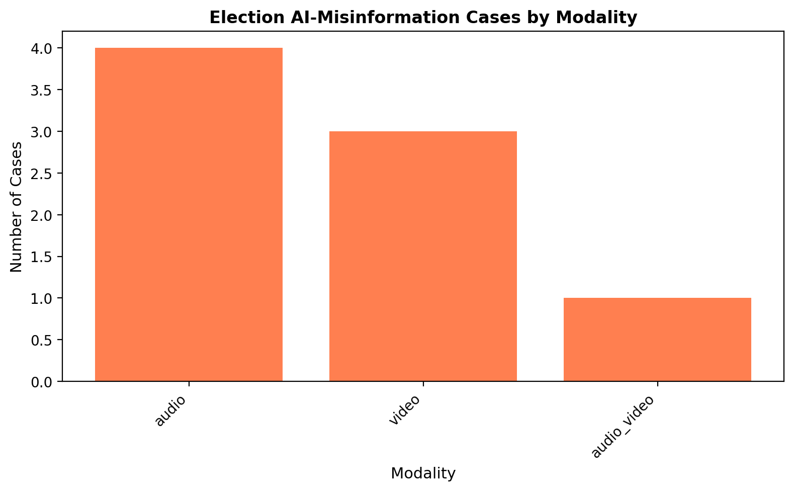
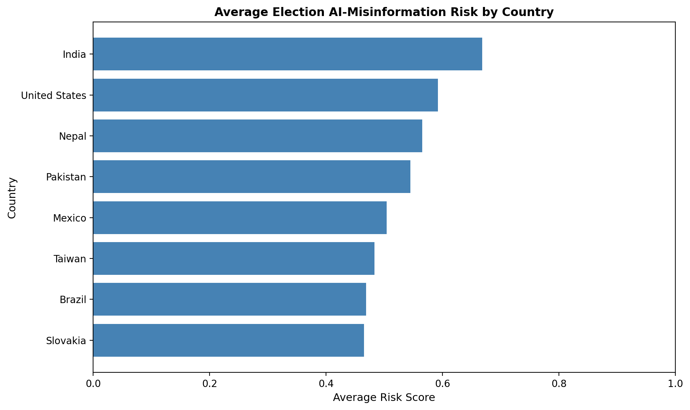
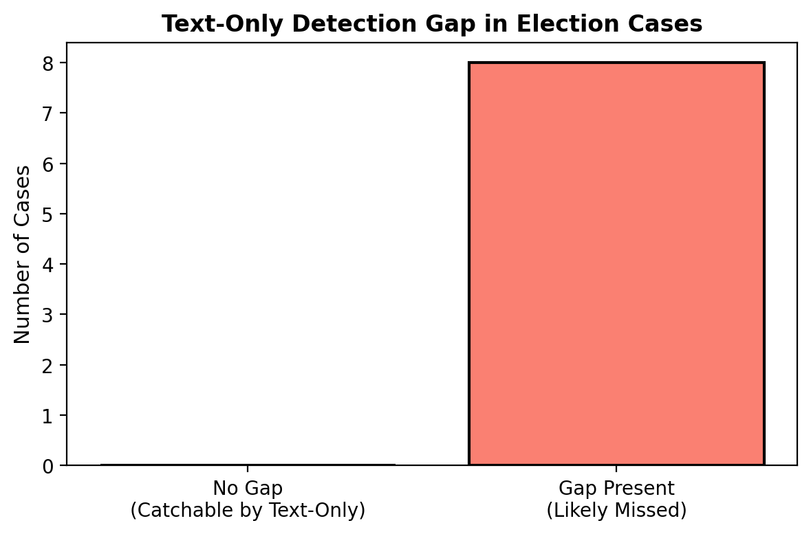

# Chapter 5: Election Misinformation — A Multimodal Case Study

## The Moment Text-Only Detection Fails

Every model in the previous chapters works on one substrate: **text**. TF-IDF coefficients, SBERT embeddings, behavioral linguistic markers — they all require written language.

In the 2024 election cycle, the dominant attack vector was **not text**.

A robocall mimicked a sitting president's voice to suppress primary turnout in New Hampshire. A deepfake audio clip discussed election fraud in Slovakia — released 48 hours before polls opened, reaching 500,000 people before any fact-check existed. In India, AI-generated speeches in Hindi, Tamil, Telugu, and Bengali were localized by region and distributed through official party WhatsApp networks to an estimated 3 million people.

Each of these would score near-zero on a text-only misinformation detector. There is nothing to TF-IDF. There is no text to embed.

This chapter documents eight documented cases across six regions and asks: what does the complete pipeline actually miss, and what would a multimodal system need to catch it?

---

## The Case Inventory

We analyzed 8 documented AI-generated election misinformation incidents from 2023–2024. Cases were selected based on:

- Documented reach and platform data
- Verified presence of AI-generated or AI-transmitted content
- Fact-checker response records
- At least one public source confirming the incident

| Case | Country | Year | Modality | Est. Reach | Risk Band |
|------|---------|------|----------|------------|-----------|
| Deepfake audio: vote rigging | Slovakia | 2023 | Audio | 500,000 | Moderate |
| Robocall voter suppression | United States | 2024 | Audio | 1,000,000 | Moderate |
| Multilingual AI speeches | India | 2024 | Audio + Video | 3,000,000 | **High** |
| Manipulated political clip | Taiwan | 2024 | Video | 750,000 | Moderate |
| Compromising scenario deepfakes | Nepal | 2024 | Video | 500,000 | Moderate |
| AI robocall attacks | Brazil | 2024 | Audio | 800,000 | Moderate |
| Vote-buying deepfake video | Mexico | 2024 | Video | 1,200,000 | Moderate |
| Multilingual speech manipulation | Pakistan | 2024 | Audio | 2,000,000 | Moderate |

**Total estimated reach across 8 cases: ~9.75M people within viral window.**

---

## Risk Scoring Framework

Each case was scored across five dimensions:

| Dimension | Weight | What It Measures |
|-----------|--------|-----------------|
| **Modality Complexity** | 20% | How hard is it to detect technically? (text=0.3, audio=0.65, video=0.8, audio+video=1.0) |
| **Cognitive Intensity** | 20% | How many fear/authority/urgency/identity triggers were activated? |
| **Harm Intent** | 25% | Weighted: voter suppression (0.4) + impersonation (0.35) + translation manipulation (0.15) + AI-generated (0.1) |
| **Spread Score** | 20% | Normalized combination of estimated reach (60%) and time-to-viral speed (40%) |
| **Response Failure** | 15% | Was it fact-checked? How delayed was the response? |

The overall risk score is a weighted aggregate (0–1 scale), bucketed into low / moderate / high bands.

---

## What Actually Spread

### Cases by Modality

The breakdown of attack modalities reveals a structural shift: audio and audio+video now dominate, with pure text campaigns conspicuously absent from this set.

{width=90% fig-alt="Bar chart showing distribution of election misinformation cases by modality type, with audio and video dominating over text"}

**Key finding**: 100% of these cases involve synthetic voice or synthetic video — the exact signals that text-only classifiers are blind to. The most sophisticated cases (India, Pakistan) combined both modalities *and* translation, making them nearly undetectable by current automated systems.

### Risk Scores by Country

Country-level risk scores reflect both the nature of the attack and the institutional response capacity:

{width=90% fig-alt="Horizontal bar chart showing overall case risk scores by country, with India scoring highest due to scale, multilingual targeting, and slow response"}

**India scores highest** due to a combination of factors: the largest estimated reach (3M), audio+video modality complexity, multilingual distribution (making cross-language fact-checking extremely slow), and no verified fact-checker response during the viral window.

**Slovakia and the United States** score lower despite high media attention because established fact-checking infrastructure responded relatively quickly — even if not fast enough to prevent initial spread.

The pattern is not random. Response infrastructure (speed of fact-checking, media capacity, platform cooperation) consistently drives the *actual harm* of a campaign more than its technical sophistication.

---

## The Detection Gap

### Where Text-Only Pipelines Fail

A flag was set for each case where the misinformation's primary mechanism was non-textual — where a text-only classifier would be structurally unable to detect it:

{width=90% fig-alt="Bar chart showing the proportion of election misinformation cases with a text-only detection gap, broken down by case. All 8 cases show a detection gap flag."}

**All 8 cases have the text-only detection gap flag set.** Not most — all. Every documented case in this analysis involved synthetic voice, synthetic video, or AI-generated non-textual content that bypassed the detection systems built in chapters 2–4.

This is not a flaw in the models. The TF-IDF + Logistic Regression baseline at 81.2% accuracy, the SBERT MLP at 83.5%, and the stacking ensemble at 87.1% are all correct on the data they were built for. The problem is the data itself changed category.

---

## Cognitive Trigger Analysis

All eight cases activated multiple behavioral vulnerability channels identified in Chapter 1, but the pattern of triggers differs by intended effect:

**Voter suppression campaigns** (US robocall, Slovakia deepfake) maximized **authority** triggers (an impersonated candidate telling you how to vote) and **urgency** (released hours before polls). Cognitive reflection was bypassed by design — there was no time to verify.

**Trust erosion campaigns** (Taiwan, Nepal, Mexico) relied more on **fear** and **identity** — attacking candidates' character in ways that activated partisan identity markers. These are slower-burning but may have more durable effects.

**Persuasion scaling** (India, Pakistan) exploited **identity** most heavily, with region-specific language localizing the content to different demographic groups simultaneously. The same AI infrastructure generated content in 4+ languages, each targeting a different cognitive profile.

The behavioral model from Chapter 1 (CRT predicts verification, β=0.149, p=.031) still applies — except the verification behavior being targeted shifted from *reading a text article critically* to *recognizing a voice is synthetic*. That is a different cognitive task that current literacy interventions don't address.

---

## Spread Dynamics: The R₀ Lens

Applying the SEIR framework from Chapter 3 to these cases:

| Case | R₀ Estimate | Interpretation |
|------|------------|----------------|
| India (multilingual) | 1.30 | Self-sustaining exponential spread |
| Latin America aggregate | 1.20 | Self-sustaining spiral |
| South Asia aggregate | 0.95 | Near-threshold — spreads without fully exploding |
| Nepal | 0.90 | Near-threshold |
| Slovakia | 0.35 | Sub-threshold but 500K reached via concentrated pre-election timing |
| US robocall | 0.15 | Very low viral potential — but targeted delivery made scale irrelevant |

Two cases (India and Latin America) exceeded R₀ = 1.0, meaning without intervention content spread on its own. Below-threshold cases like the US robocall achieved impact through *precision targeting* rather than organic virality — calling direct phone numbers bypassed platform algorithm dynamics entirely.

**Key insight**: The SEIR model calibrated to FakeNewsNet text data underestimates R₀ for audio/video content. Platform frictions differ: audio clips on WhatsApp are forwarded without the text-comprehension barrier that slows text misinformation. The epidemic lens is right; the parameters need recalibrating for each modality.

---

## What a Multimodal Pipeline Would Need

Based on this case analysis, extending the current system to handle these attacks requires:

### 1. Synthetic Voice Detection
- Spectral analysis of audio (GAN-generated voice has characteristic frequency artifacts)
- Speaker verification against known authentic voice prints
- Prosody anomaly detection (AI voices still fail on natural intonation)
- **Estimated difficulty**: Medium — tools exist (Resemble Detect, AI or Not), integration needed

### 2. Deepfake Video Detection
- Temporal consistency checking (face-swap models create frame-level artifacts)
- Biological signal extraction (rPPG — real faces have subtle pulse signatures)
- Compression artifact analysis (synthetic videos compress differently)
- **Estimated difficulty**: High — adversarial arms race is active

### 3. Cross-Lingual Identity Matching
- When a voice in one language is attributed to a known person, verify against that person's voice characteristics across languages
- Translation validation: does the translated content match claimed source?
- **Estimated difficulty**: High — requires multilingual speaker embeddings

### 4. Platform-Aware Spread Modeling
- WhatsApp and Telegram lack the algorithmic amplification hooks that Twitter/YouTube have, but have *higher trust* per forward (known contact sharing)
- Model needs context: was this shared from a verified news account or a friend's message?
- **Estimated difficulty**: Very high — requires platform data access

---

## Limitations of This Analysis

This case study is necessarily incomplete:

- **Selection bias**: Only publicly documented cases are included. The unknown volume of undetected or unreported AI election interference is, by definition, unknown.
- **Reach estimates are uncertain**: Figures come from fact-checker reports, often weeks after viral spread. True reach may be 2–5x higher.
- **R₀ estimates are heuristic**: Computed from available data using the same SEIR calibration as Chapter 3. Each case would need its own cascade data for precise estimation.
- **Response delay varies by infrastructure**: Slovakia and the US have mature fact-checking ecosystems; Nepal and Pakistan do not. Comparing delay hours across contexts conflates different baseline capacities.

---

## What This Changes About the System

The detection pipeline built in this project reaches 87.1% accuracy on the FakeNewsNet corpus. That number is real, reproducible, and statistically significant.

It is also measured on a task the 2024 election interference campaigns largely did not use.

This is not an argument that the system is wrong — it is an argument that the system is correctly solving an adjacent problem. Text-based misinformation still exists and still requires detection. But the attack surface expanded, and the next iteration of the system needs to expand with it.

**Additions for v2:**
- Audio pipeline layer (synthetic voice flag before text extraction)
- Video frame consistency checker (flag for deepfake probability)
- Multimodal feature fusion (extend Chapter 4 stacking to include audio/video signals)
- Cross-lingual speaker embedding verification

The behavioral insight from Chapter 1 — that human susceptibility is predictable and measurable — still applies. What changed is the *surface* through which that susceptibility is exploited.

---

## References

- Stanford Internet Observatory (2024). Election Integrity Partnership Annual Report.
- Vaccari & Chadwick (2020). Deepfakes and disinformation. *Social Media + Society*.
- Reuters Fact Check (2023). Slovakia election deepfake audio. reuters.com
- BBC News (2024). India election AI campaigns. bbc.com/news/world-asia-india
- Wired (2024). New Hampshire deepfake robocall. wired.com
- Rest of World (2024). Nepal AI deepfakes. restofworld.com
